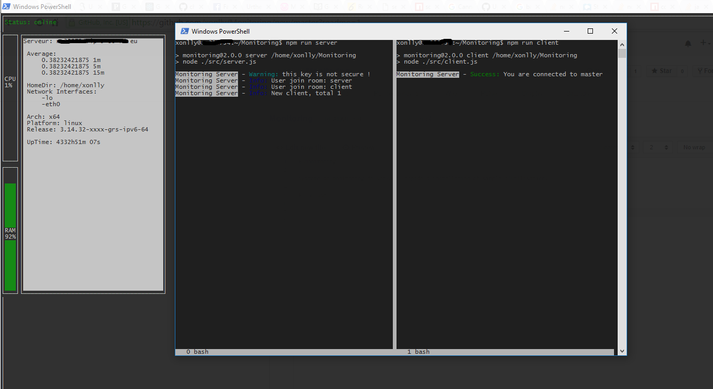
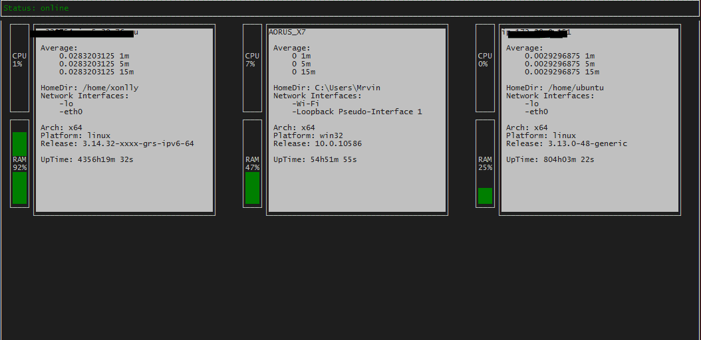

[](https://app.wercker.com/project/bykey/9ee8e2311a78e29e80c5c2915743610f)
[](https://travis-ci.org/xonlly/Monitoring)
[](https://david-dm.org/xonlly/Monitoring#info=dependencies&view=table)
[](https://david-dm.org/xonlly/Monitoring#info=devDependencies)
[](https://badge.fury.io/js/monitoring-easy)

[](https://nodei.co/npm/monitoring-easy/)
[](https://nodei.co/npm/monitoring-easy/)

# Monitoring easy

Server monitoring system, rapid installation and simple to use.

___





___

# My node project

```bash
  npm install monitoring-easy
```

```javascript
require('monitoring-easy')({
  /* All is optional */
  name : 'MyProject',
  host : 'yourServer.fr',
  port : 8156,
  key : '456DAde486qD684de6'
})
```

___

# My server

```bash
  npm install monitoring-easy
```

## Run new "client" server

`npm run client` or `node ./src/client.js -p port -h host -k key`

### You need get network traffic ?

- On __Linux__ you need ifstat `sudo apt-get install ifstat` or go to download lib http://gael.roualland.free.fr/ifstat/
- On __Windows__ i have adding ifstat on the project, no command required.

## Run a master listenner

`npm run server` or `node ./src/server.js -p port -k key`

## Run a display for view live monitoring

`node run display` or `node ./display -p port -h host -k key`

___

# Create a custom display

## You need just a simple SocketIO client for get servers infos

```javascript

var socket    = require('socket.io-client')('http://'+yourserver+':'+port);

socket.on('connect', function(){
  // The master is online
  // Send a authentif to server
  socket.emit('auth', security_key);
});

// Result of authentif
socket.on('isAuth', function (r) {
  if (r.success) {

    // Join client room
    socket.emit('room', 'client')
    
    // Security key is valid go to next stape
  } else {
    // Security key is not valid
  }
});

// Informations is updated here, is active then if you are authentified
socket.on('update', function(data){
  /*
  data content:

  name : os.hostname ? os.hostname() : false,
  arch: os.arch ? os.arch() : false,
  cpus: os.cpus ? os.cpus() : false,
  freemem: os.freemem ? os.freemem() : false,
  totalmem: os.totalmem ? os.totalmem() : false,
  mempourcent: 100 - (os.freemem() * 100 / os.totalmem()),
  homedir: os.homedir ? os.homedir() : false,
  loadavg: os.loadavg ? os.loadavg() : false,
  networkInterfaces: os.networkInterfaces ? os.networkInterfaces() : false,
  platform: os.platform ? os.platform() : false,
  release: os.release ? os.release() : false,
  type: os.type ? os.type() : false,
  uptime: os.uptime ? os.uptime() : false,
  cpuAverage: this.currentCPU,
  traffic: this.traffic,
  */
});

socket.on('disconnect', function(){
  // the master is offline.
});

```

___

# Change config for server monitoring

## Client

Go to ./src/client.js and edit config

## Server

Go to ./src/server.js and edit config

## Display

Go to ./display and edit config

# WebDisplay

The webdisplay is coming soon

___
# Current todolist

- Web Display
- ~~Client compatibility node 0.x~~
- Forever script
